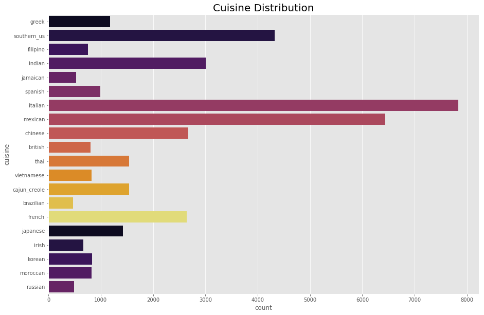

# Predict Cuisine from Ingredients
## Predict the category of a Dish's Cuisine given a list of its ingredients

**Author**: SHAILESH DHAMA

### GOAL:

Predict the category of a Dish's Cuisine given a list of its ingredients

### LIBRARIES:

    1.Numpy
    2.Pandas
    3.Matplotlib
    4.Seaborn
    
### DATASET:

The dataset(./foodisdelicious.csv) contains id with dishes and their respective cuisines.

## STEPS:

- Ingredients in a Dish
- Top Cuisines
- Main Ingredients
- Finding Similar Dishes
- Encode cuisines to numeric values using LabelEncoder.
- Dishes Similar to Dish No.1
- Top Bigrams by Cuisines
- Network Diagrams for Bigrams
- Modelling
  - Logistic Regression
  - Ensemble Model

## RESULTS :

#### Ingredients in a Dish Distribution

> Ingredients in a Dish.

#### Cuisine Distribution

> Top Cuisines.

#### Main Ingredients

> Top 15 Ingredients.

#### Top Bigrams by Cuisines

> Top Bigrams by Cuisines.

#### Network Diagrams for Bigrams

> Top 25 Bigrams for french and mexican


> Top 25 Bigrams for thai and chinese

### For further information
Please review the narrative of our analysis in [our jupyter notebook](./master-cooking.ipynb)

For any additional questions, please contact **shaileshshettyd@gmail.com)

##### Repository Structure:

```
├── README.md                       <- The top-level README for reviewers of this project.
├── master-cooking.ipynb            <- narrative documentation of analysis in jupyter notebook
└── images                          <- both sourced externally and generated from code
```
